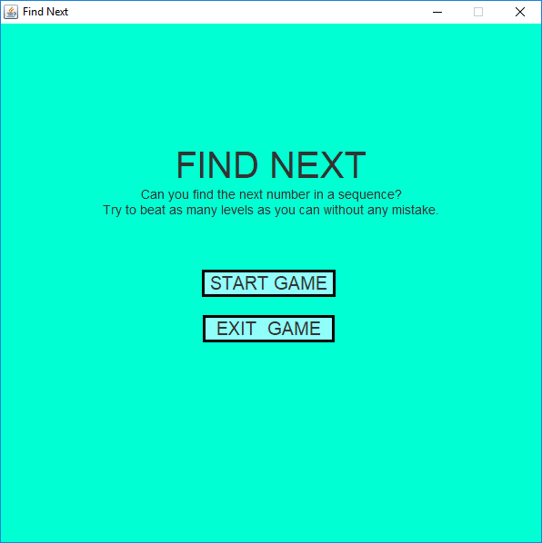
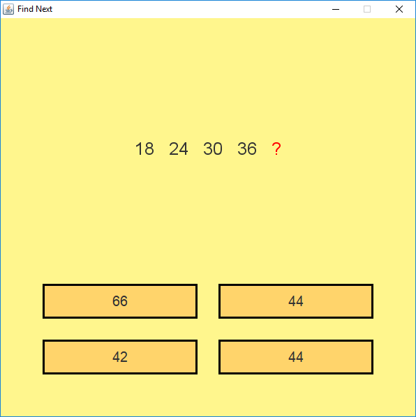
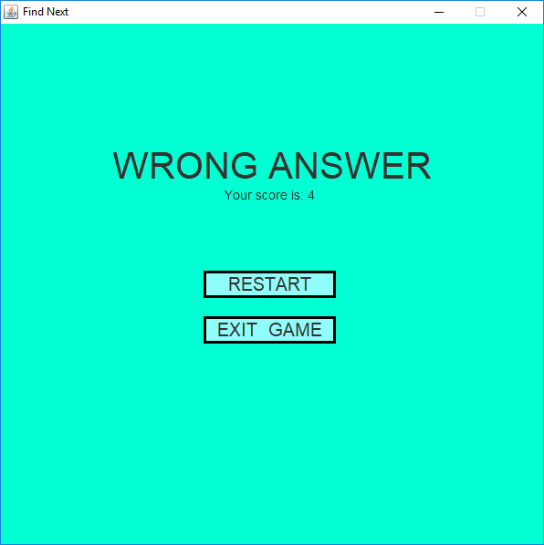

# FindNextGame
A simple game using the Java Swing GUI.

## Table of contents
* [Screenshots](#screenshots)
* [General info](#general-info)
* [Motivation](#motivation)
* [Inspiration](#inspiration)
* [Technologies](#technologies)

## Screenshots

## General info
The program generate random sequence of numbers based on arithmetics or geometric progrssion. A player's task is to guess a fifth number of the sequence. If answer is correct the program generate next random sequence, if not the player's score is displayed.

## Motivation
Motivation to create this game was to crate a window application with simple algorithm that will extend the game time by looping task.

## Inspiration
The application is completely created by me. The game idea is also mine. I wanted to learn Swing so I didn't use any GUI generator.
I used a Stackover Flow and documentation. 

## Technologies
* Java 8
* Swing GUI
